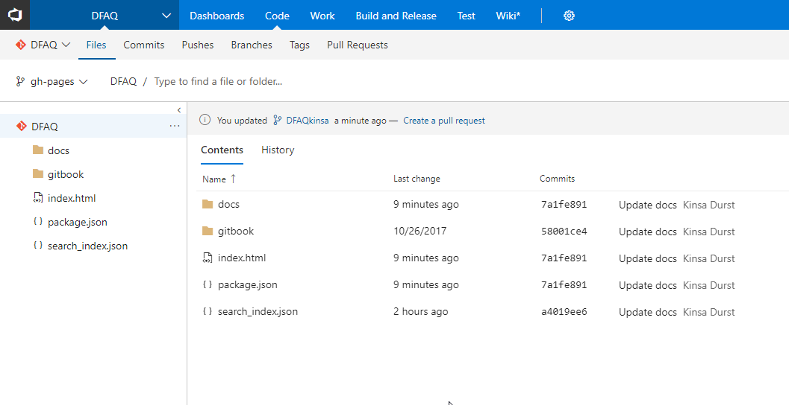
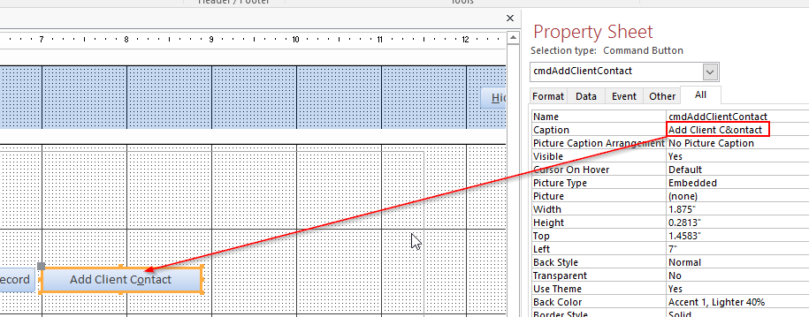

#### Q: Why is gh-pages not pushed to VSTS?

#### A: It is now pushed to VSTS!

It was done by adding another npm gitbook publish command that force pushed the contents of \_book to gh-pages branch in VSTS using SSH connection

#### Q: All the buttons in the databaase have a bar under one of the characters, is this just a Microsoft Access quirk? what does it mean?

#### A: 

It means you can use keyboard shortcuts for the command.
> e.g. Alt+i, Alt+n, Alt+o

This is what it looks like in the form:

