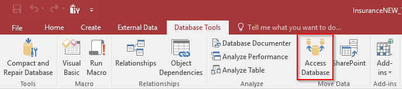

# Split Single Microsoft Access database to Front and Back End

 1. Replace table links with queries -- refer to my guide: 

 2. Under `Databse Tools` select `Access Database`

 

 3. Click `Split Database` and decided where to save your backend

 > You can name your backend `your_database_be` or `your_database_DATA`

 The database you split from will be the front end!
