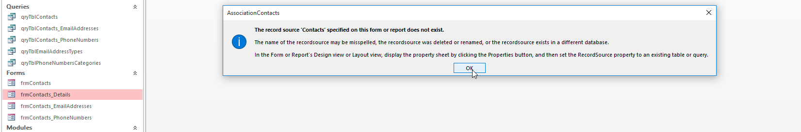
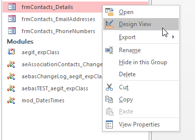
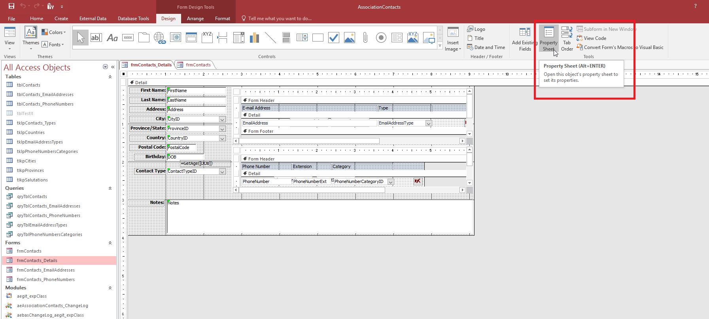

# Adding Query to your form

In this specific example, my form has been linked directly to a table. I rename that table which causes the form to lose track of the table and following error shows up when I click on the form:

I go to design view of the form to view the layout

As you can see the green marks represent fields with no links to table/query

Go view the property of the form:

Click on the background of the form to view the record source

as you can see the record source is linked to the table

## Add Query

Go select query design under create tab

Add the table which you want the query to link to 

Drag the query elements into the table below

> you can select all using ctrl+a in the little box, then drag it into the table

Save query

## Add query to form

Go to the form property sheet, then select the new query you created in the record source

