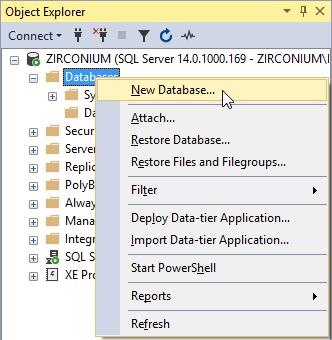
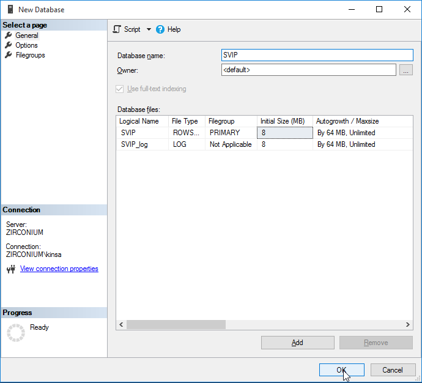
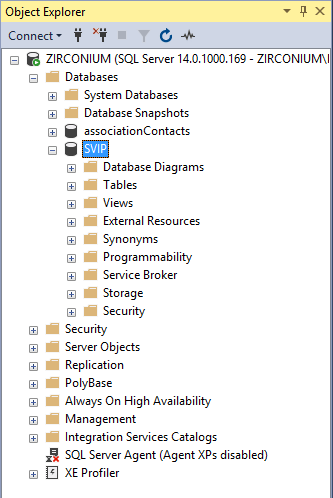
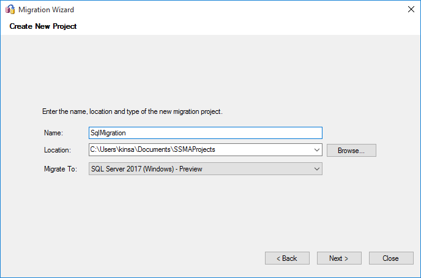
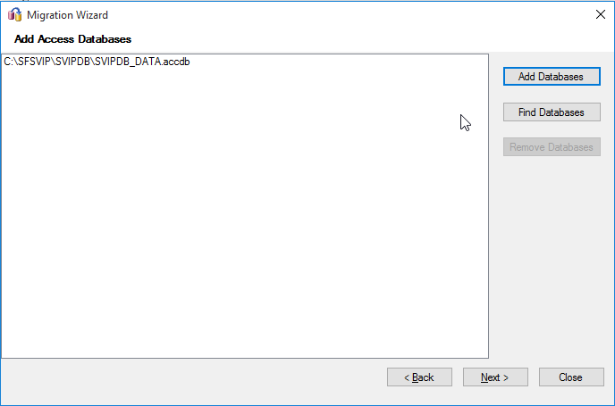
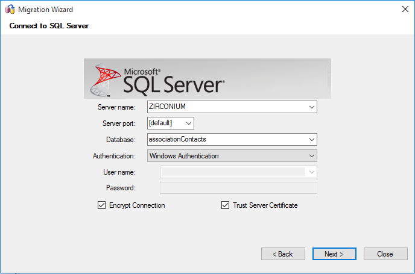
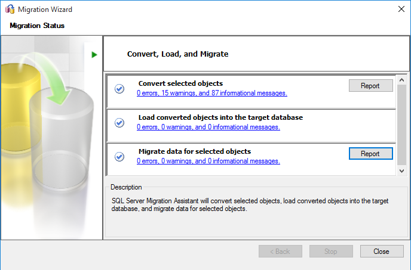
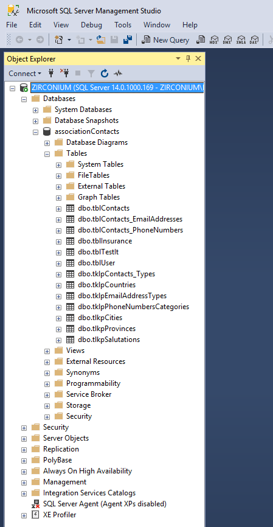

# Upsize Microsoft Access Database

#### "*Upsizing*" is the term coined by Microsoft to describe the process of upgrading Microsoft Access Database to a Microsoft SQL Server

- It allows you to set Microsoft Access as a database front-end while running back-end which is served by a separate local or remote SQL Server, resulting in greater productivity and data volumes.

### Setup

1. Download [SQL Server 2017 for Windows](https://www.microsoft.com/en-us/sql-server/sql-server-downloads)

    - Comes with many tools: Analysis Services, Integration Services, Configuration tools, Performance tools, import, export, etc.

2. Open SQL Server 2017 Configuration Manager to check that the current version of SQL Server is running

    > MSSQL14.MSSQLSERVER is a default instance of SQL Server 2017

    <!-- 1. In SQL Server Services, for each SQL Server go to properties and under the advanced tab, Instance ID displays which version of SQL Server it is running.

    
    
        - Make sure it displays MSSQL14.MSSQLSERVER
            > MSSQL14.MSSQLSERVER is a default instance of SQL Server 2017

     -->

### Create SQL Server & Database

3. Install and start [Microsoft SQL Server Management Studio 2017](https://docs.microsoft.com/en-us/sql/ssms/download-sql-server-management-studio-ssms)

4. Create a SQL server
    
    - Select database engine as server type and browse for a server name
    

5. Create a new database which you will migrate your Microsoft Access into

    

6. Input name for the database and select OK

    

    - You should see the created empty database in your SSMS Object Explorer

        

### Migrate Microsoft Access 

6. Install and start [Microsoft SQL Server Migration Assistant 2017](https://www.microsoft.com/en-us/download/details.aspx?id=54255)

7. You will be greeted by a Migration Assistant Wizard, which you can follow its prompts for your migration- select "next"

7. Create new migration, select migrate to SQL 2017

    

8. Click "Add Database" and select the appropriate Backend Data you would like to convert to SQL Server

    

8. Select the tables you want to migrate

    

9. Select the SQL Server created with Microsoft SQL Server Management Studio and select appropriate database

    

10. Wait for migration to complete, then check for errors

    

11. Check SQL database for migrated data, and you're done!

    

