# Set up RDA Computer

## Original Setup

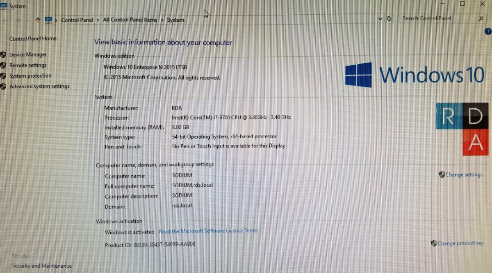

## Install updated Windows 10

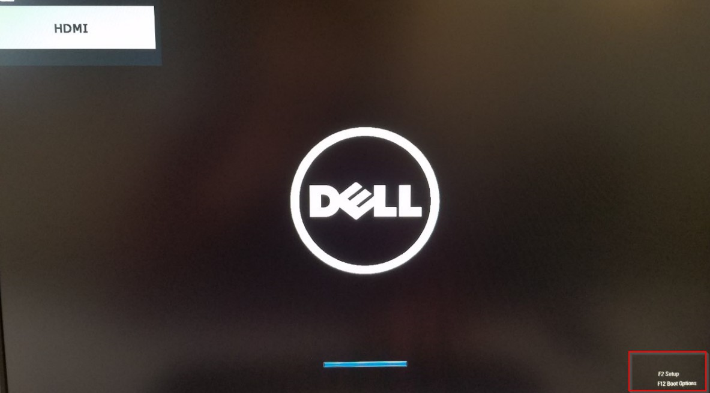

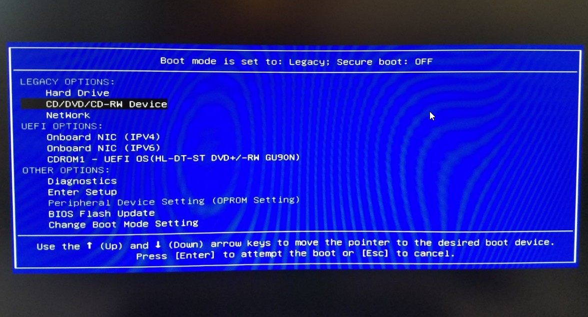
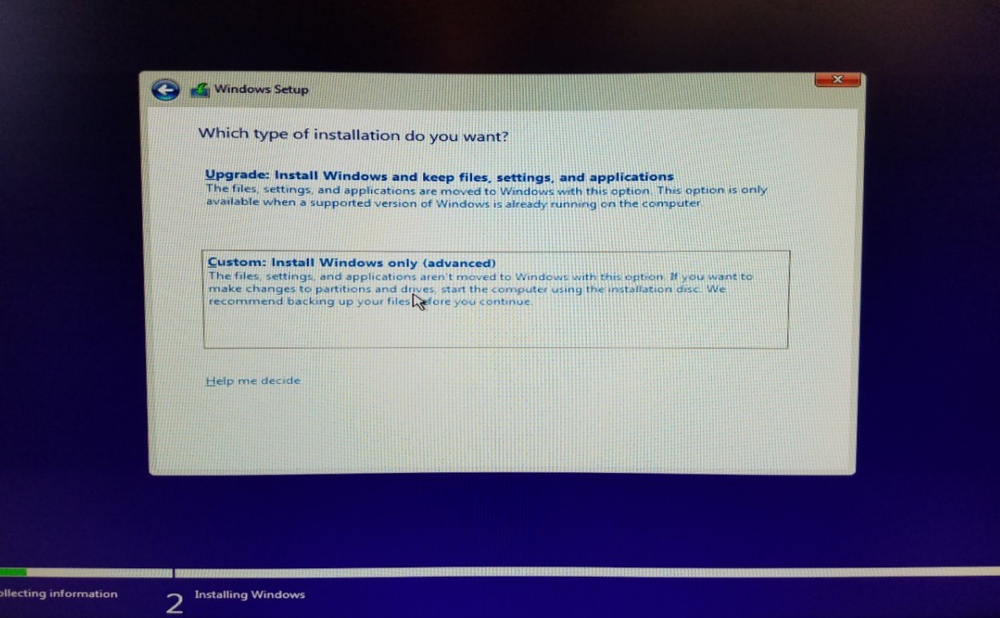
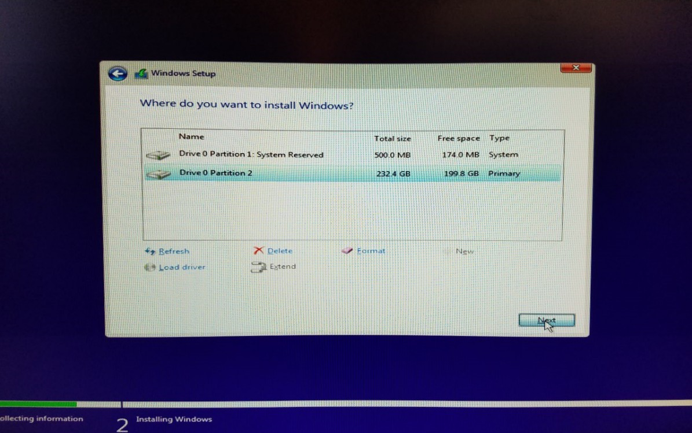
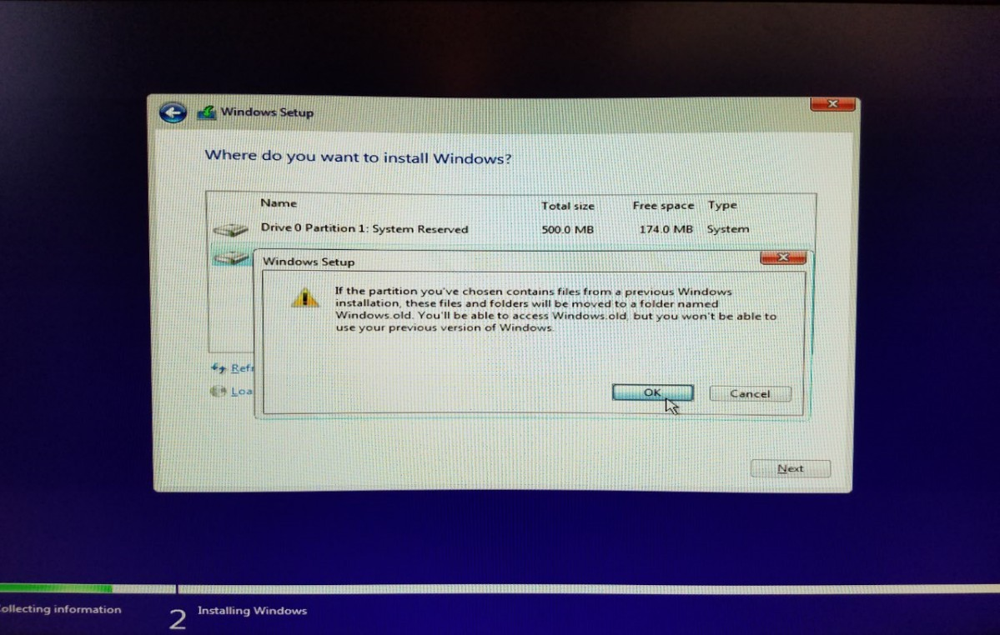

## Connect to the network

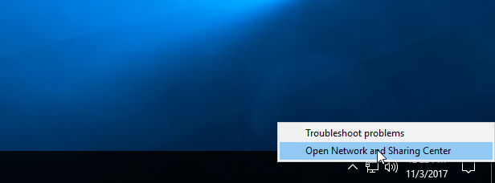
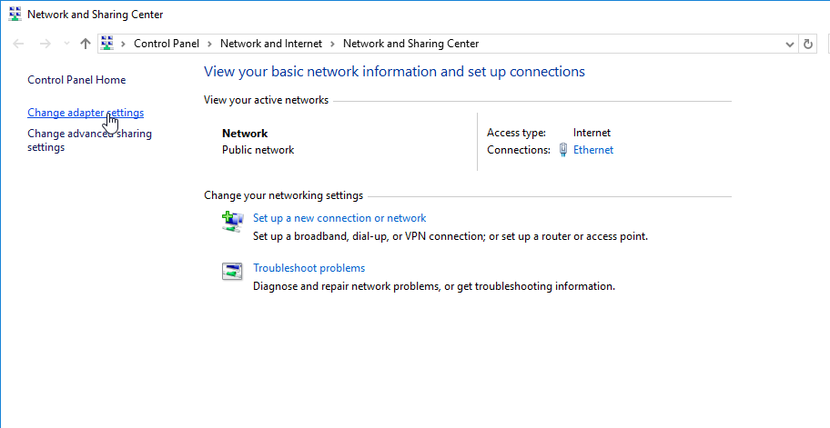

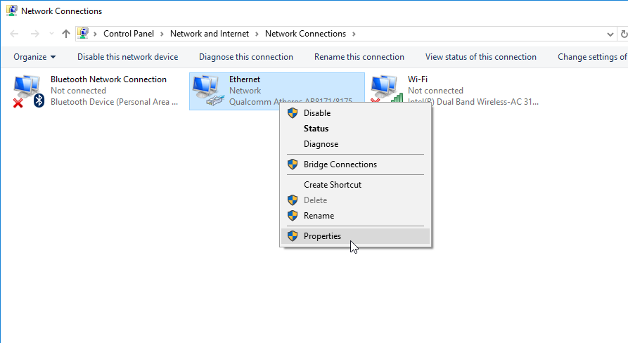

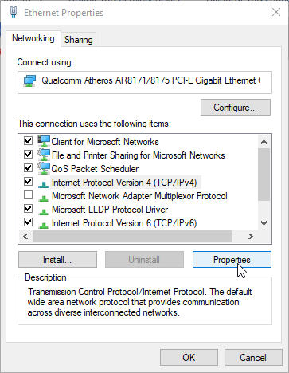

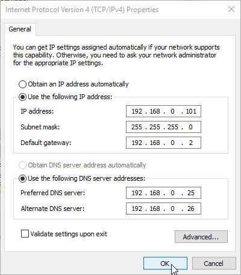

## Install updates

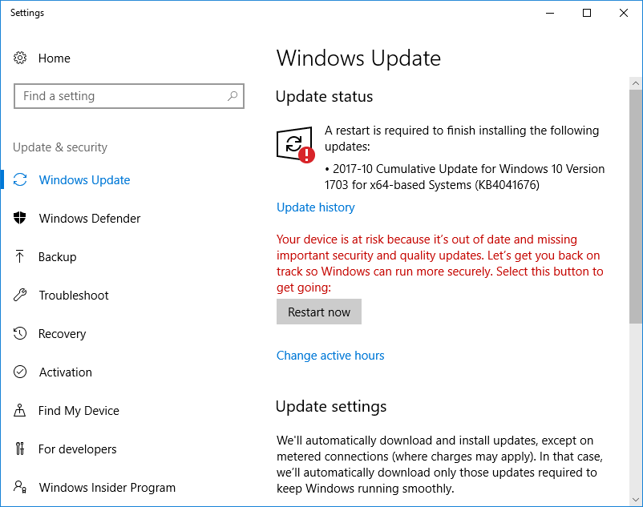

## Configure to your preferences

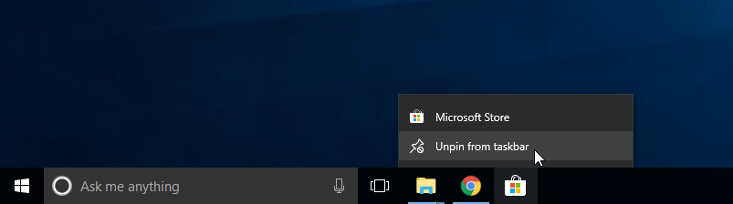

## Install necessary programs

