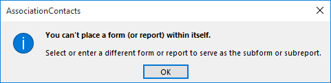
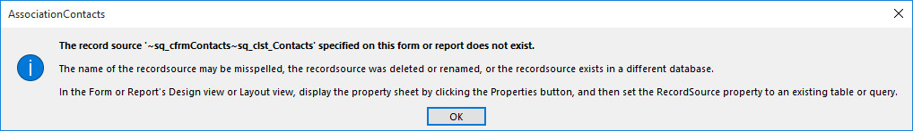
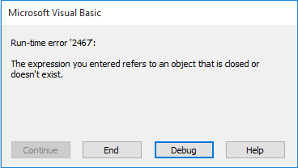

## Things to learn & questions that need to be answered

* Q: Following messages on database startup:

    
    
    

* Q: After putting front and back end files in shared network folder, how should I set the user access permissions?

    

