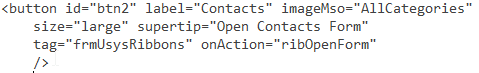
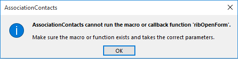
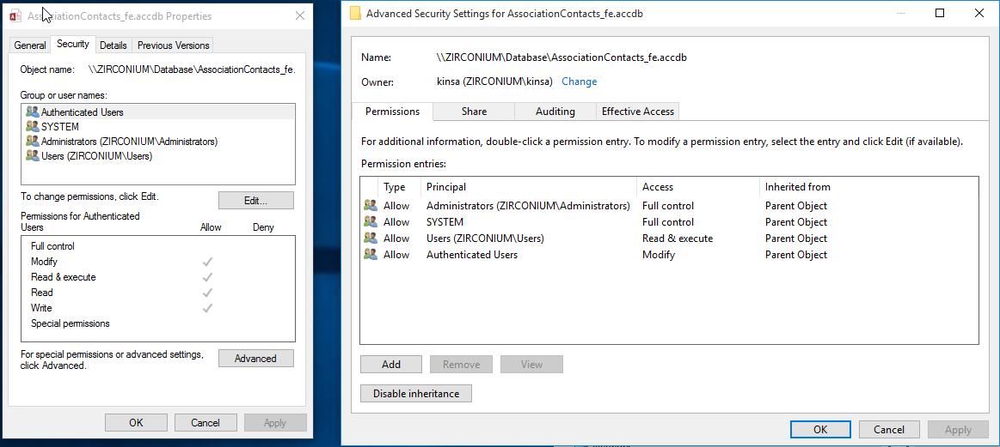

## Things to learn & questions that need to be answered

* Q: Problems with running a function activated by ribbon click

I created a module and added a Sub to it which will open a specific form when a ribbon button is clicked.

Here's the sub code: 

Here's the XML for the button:

And this is the error message I get:

* Q: After putting front and back end files in shared network folder, how should I set the user access permissions?

