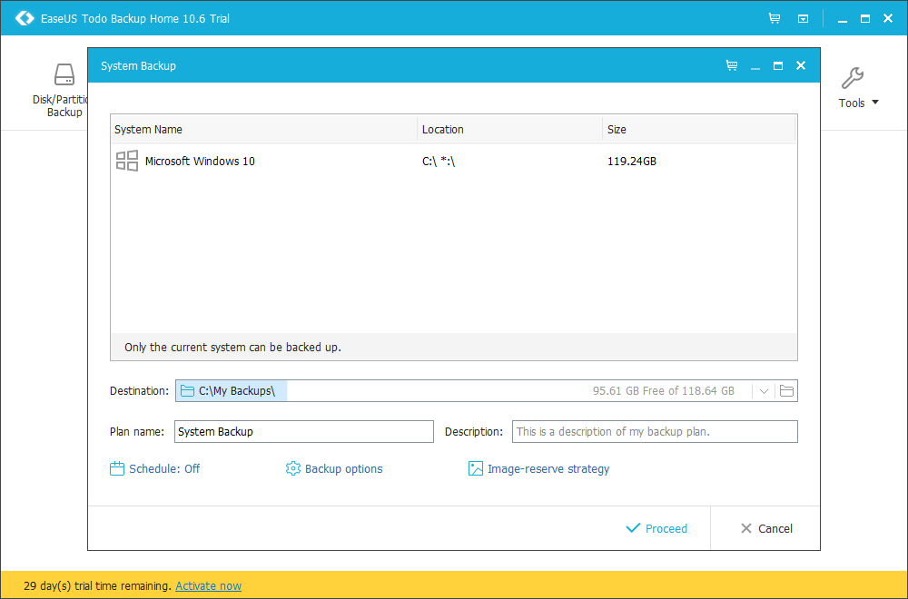
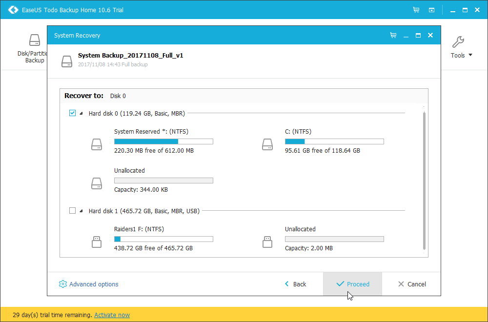
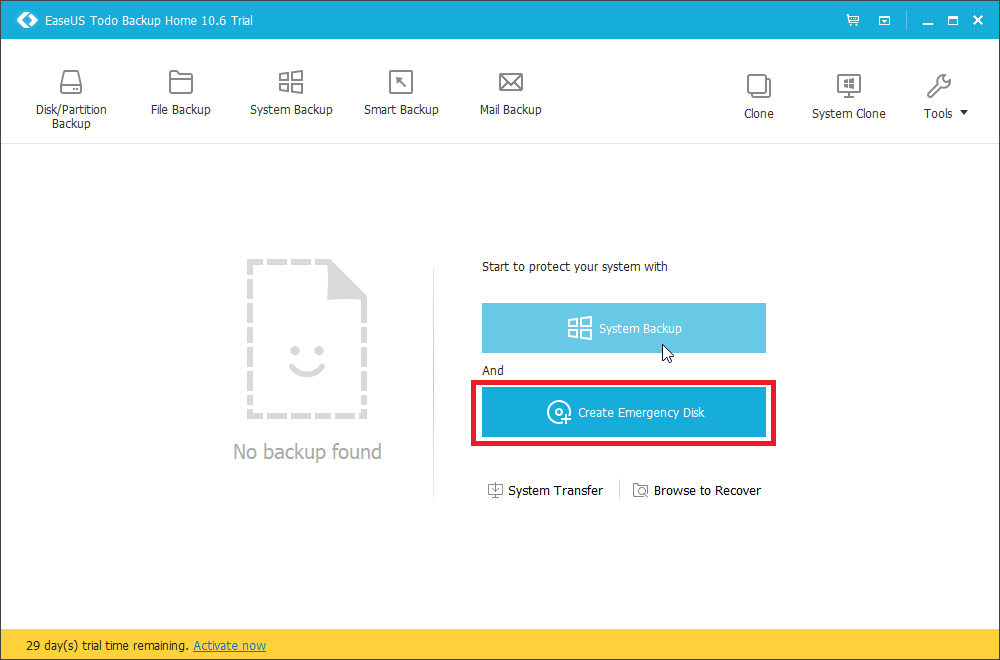

# Steps to Create backup image of your computer and install onto new disk

1. uninstall/ delete unnecessary files on computer.  Delete windows.old if it exists
    * you can delete it using Disk Cleanup.  Click on clean up system files, and select previous windows version for deletion
2. Backup your data using EaseUS Todo Home 10.6

* choose destination
> IMPORTANT: Make sure to back up your image to external memory! Saving it locally can cause problems. 

5. under backup options you have control over image size, export speed, etc.

6. Create emergency disk

7. prepare your destination hard drive by deleting all partitions using Windows Disk Management
    * You can also install EaseUS Partition Master Free which will give you more control
8. check disk format of the one you have created the image from. You can check this in disk management, by right clicking on the disk
    * If your disk is in MBR format, you will have the option that says "convert to GPT disk" and vice versa
    * If your destination disk is different format, click on "covert to MBR/GPT"
10. Locate your image on EaseUS Todo Home 10.6 by clicking on "Browse to recover"
11. under advanced options, optimize for ssd if it applies
